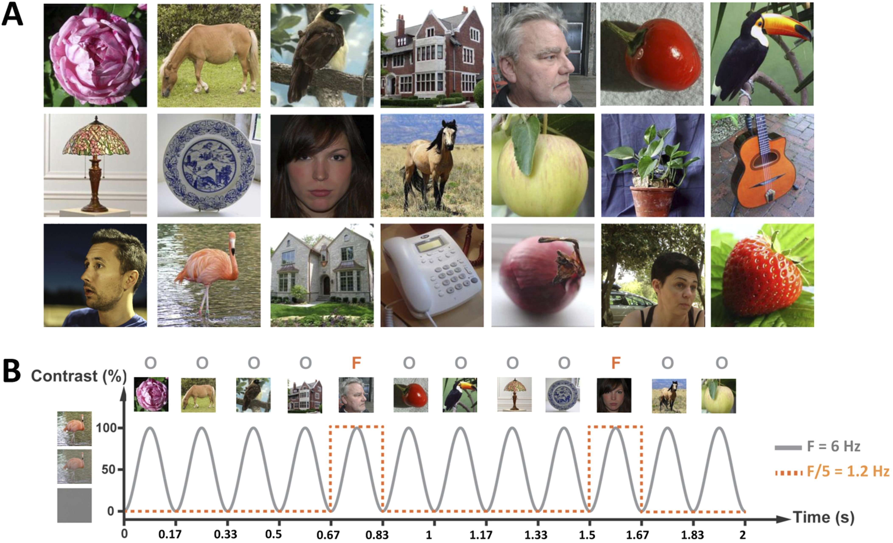

# Predicting cognitive empathy from face specific neural signatures
- Owen E Parsons (oep20@cam.ac.uk)
- Richard Bethlehem (rb643@cam.ac.uk)
- Jan Freyberg (jan.freyberg@kcl.ac.uk)
- Simon Baron-Cohen (sb205@cam.ac.uk)

## Abstract:
We investigated whether face specific neural signatures predicted cognitive empathy ability in healthy adults. Participants were exposed to a fast serial visual presentation (FSVP) task comprised of various nonsocial images and images of faces. Cognitive empathy ability was assessed using the Reading the Mind in the Eyes Task (RMET). Our results provide moderate evidence for a correlation between performance on the RMET and face specific neural signatures in the left fusiform face area.

## Introduction
Electrophysiological neural signatures have also been shown to be selectively responsive to natural face categorization. Recently, de Heering & Rossion (2015) showed that face stimuli shown at specific frequencies can elicit steady state visual evoked potentials (SSVEP) at the stimuli frequency. Both the passive nature and short duration of this task make it suitable for use in clinical populations where task comprehension may be low. To test the paradigms suitability to such applications, we tested whether the relative size of these face specific frequency amplitudes is related to a behavioural measure of face processing in a typical population. We chose to look at emotional recognition using the RMET, a measure that robustly detects deficits in certain clinical groups such as those with autism spectrum conditions.

## Methods
### Task

Figure 1: Image sequence showing primary 6Hz frequency of object images (O) and secondary 1.2Hz frequency of face images (F) – taken from de Heering & Rossion (2015).

### Analysis
Analysis was done using a combination of [MNE](https://martinos.org/mne/stable/index.html) and [SSVEPY](https://github.com/janfreyberg/ssvepy) and wrapped in a python notebook wrapper included [here](./Scripts/Face_categorization_Clean.ipnyb).

## References
de Heering, A., & Rossion, B. (2015). Rapid categorization
of natural face images in the infant right hemisphere. Elife, 4,
e06564.
